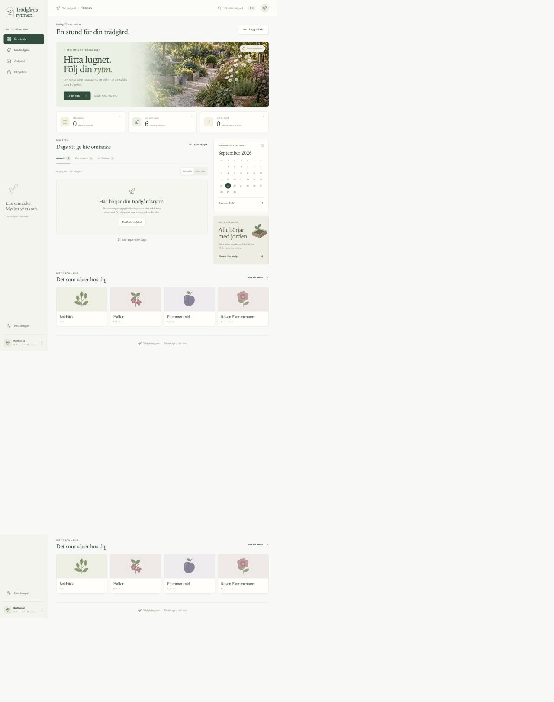
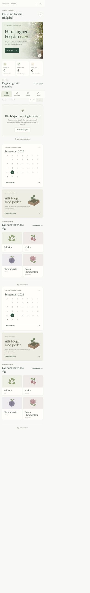

# Trädgårdsrytmen

A garden planner that turns seasonal care into small, manageable tasks. Group a round by the work you want to do or by the part of the garden you are in, then keep a history of what you have finished.

Built with Python, Django, SQLite and plain JavaScript. The interface is in Swedish and works on desktop and mobile as an installable PWA.



## Try it locally

Requires Python 3.12 or 3.13 on macOS or Linux. On Windows, use WSL; the push-key helper uses POSIX file locking. No Node.js build or API key is needed.

```sh
git clone https://github.com/jockeoh/tradgardsrytmen.git
cd tradgardsrytmen
python3 -m venv .venv
source .venv/bin/activate
python -m pip install -r requirements.txt
python manage.py migrate
python manage.py createsuperuser --username demo
python manage.py seed_demo --owner demo
python manage.py runserver 127.0.0.1:8000
```

Open [localhost:8000](http://127.0.0.1:8000). The fictional example garden contains six plants, three areas and tasks dated relative to the current month. The demo command refuses to run if any garden data already exists.

Try switching between **Efter jobb** and **Efter plats**, opening a task, marking it complete, and editing a plant's location. **Årshjulet** shows the annual overview. **Min trädgård** provides plant search, category filters and area management; **Inställningar** holds the garden profile. **Inköpslista** includes a soil calculator and a shopping list saved on the current device.

Logga in med det uttryckligt skapade demokontot. Demo tasks are interface examples, not seasonal gardening advice. `seed_garden`, schemalagda jobb och underhållskommandon kräver numera ett uttryckligt `--garden UUID`.

<details>
<summary>Mobile task view</summary>



</details>

## How it works

- **Seasonal rules and task history are separate.** A care rule defines a window; a task occurrence records a particular season's work. Unique occurrence keys keep repeated materialization from creating duplicates, including across New Year.
- **Work and location are separate.** A fixed set of work categories makes it possible to do a watering or inspection round across several areas. Moving a plant does not change the kind of work it needs.
- **AI suggestions require review.** Saving a plant does not start research. A separate, disclosed action sends context to OpenAI and creates a versioned proposal with sources and uncertainties. Only selected, approved rules become active. Manual plants and tasks work without AI.
- **The server owns garden data.** SQLite holds plants, plans, tasks and reminder history. Browser-only drafts/preferences are scoped by account and garden. The service worker caches only static assets, never authenticated HTML or the garden API.

## Tests

```sh
python manage.py check
python manage.py makemigrations --check --dry-run
python manage.py test
node --test tests/design-review.test.cjs
python manage.py collectstatic --noinput
```

Tests cover seasonal windows, duplicate prevention, proposal approval and source matching, preservation of task history, area changes, reminder deduplication and safe demo creation. GitHub Actions runs the Django checks on Linux and macOS. Run the JavaScript regressions locally with the Node command above.

## Project layout

| Location | Responsibility |
| --- | --- |
| `garden/models.py` | Plants, areas, versioned plans and task history |
| `garden/tasks.py` | Seasonal windows and task materialization |
| `garden/research.py` | Optional research and proposal approval |
| `garden/views.py` | JSON endpoints and the app shell |
| `garden/static/garden/` | Interface, styles and service worker |
| `garden/management/commands/` | Demo data, reminders and backups |
| `systemd/`, `scripts/` | Private Linux deployment |

## Deployment and boundaries

P2 adds Django login, garden memberships and garden-level authorization for both the old private API and `/api/v1/`. Auth0 EU is the chosen identity direction, with explicit account linking during the pilot, but the OIDC verifier stays disabled until issuer, audience and JWKS are explicitly configured. Keep the service private: tenant integration, legacy-data rehearsal, PostgreSQL/background jobs and launch operations remain unfinished.

See [configuration and private deployment](docs/deployment.md) for optional AI, Web Push, backups and hosting. Environment variables are read from the process; `.env.example` is a reference and is not loaded automatically.

The main limitations are the not-yet-configured Auth0/revocation integration, synchronous AI requests, SQLite and the lack of offline editing/background research queue.

The sprout icon is from [Lucide](https://lucide.dev/); attribution is in [the icon licence](garden/static/garden/icons/LICENSE.txt).

## Design and product direction

The September 2026 redesign adds a botanical identity, responsive navigation, plant filtering, a clearer annual calendar, and soil-to-shopping planning. See [design decisions, partner direction, image provenance and verification](docs/design-refresh.md).

## Mobile product roadmap

The proposed transition to an iPhone and Android product is documented in
[product goals](docs/product-v1.md), [architecture](docs/architecture.md), and
[implementation roadmap](docs/roadmap.md). These documents separate agreed
direction from open decisions. P2 implements the local server foundation, but
does not authorize public operation or a store launch.
