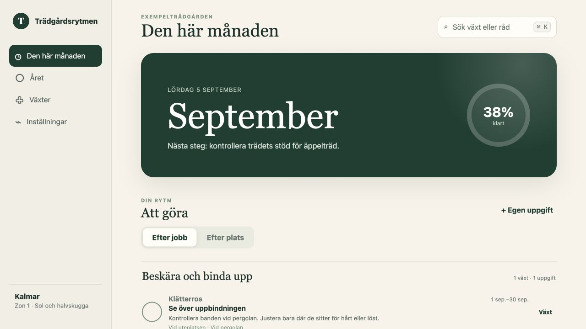
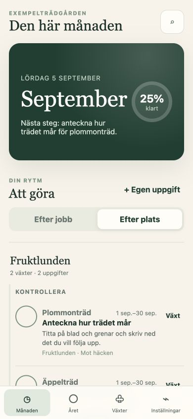

# Trädgårdsrytmen

A garden planner that turns seasonal care into small, manageable tasks. Group a round by the work you want to do or by the part of the garden you are in, then keep a history of what you have finished.

Built with Python, Django, SQLite and plain JavaScript. The interface is in Swedish and works on desktop and mobile as an installable PWA.



## Try it locally

Requires Python 3.12 or 3.13 on macOS or Linux. On Windows, use WSL; the push-key helper uses POSIX file locking. No Node.js build or API key is needed.

```sh
git clone https://github.com/jockeoh/tradgardsrytmen.git
cd tradgardsrytmen
python3 -m venv .venv
source .venv/bin/activate
python -m pip install -r requirements.txt
python manage.py migrate
python manage.py seed_demo
python manage.py runserver 127.0.0.1:8000
```

Open [localhost:8000](http://127.0.0.1:8000). The fictional example garden contains six plants, three areas and tasks dated relative to the current month. The demo command refuses to run if any garden data already exists.

Try switching between **Efter jobb** and **Efter plats**, opening a task, marking it complete, and editing a plant's location. **Året** shows the annual overview; **Inställningar** lets you manage areas and the garden profile.

To start your own garden, skip `seed_demo`. You can add plants yourself, or run `seed_garden` for six starter plants. Demo tasks are interface examples, not seasonal gardening advice.

<details>
<summary>Mobile task view</summary>



</details>

## How it works

- **Seasonal rules and task history are separate.** A care rule defines a window; a task occurrence records a particular season's work. Unique occurrence keys keep repeated materialization from creating duplicates, including across New Year.
- **Work and location are separate.** A fixed set of work categories makes it possible to do a watering or inspection round across several areas. Moving a plant does not change the kind of work it needs.
- **AI suggestions require review.** Optional research creates a versioned proposal with sources and uncertainties. Only selected, approved rules become active. Manual plants and tasks work without AI.
- **The server owns the data.** SQLite holds plants, plans, tasks and reminder history. The browser remembers the selected grouping. The service worker caches the app shell; it does not provide offline editing or cache the garden API.

## Tests

```sh
python manage.py check
python manage.py makemigrations --check --dry-run
python manage.py test
python manage.py collectstatic --noinput
```

Tests cover seasonal windows, duplicate prevention, proposal approval and source matching, preservation of task history, area changes, reminder deduplication and safe demo creation. GitHub Actions runs these checks on Linux and macOS.

## Project layout

| Location | Responsibility |
| --- | --- |
| `garden/models.py` | Plants, areas, versioned plans and task history |
| `garden/tasks.py` | Seasonal windows and task materialization |
| `garden/research.py` | Optional research and proposal approval |
| `garden/views.py` | JSON endpoints and the app shell |
| `garden/static/garden/` | Interface, styles and service worker |
| `garden/management/commands/` | Demo data, reminders and backups |
| `systemd/`, `scripts/` | Private Linux deployment |

## Deployment and boundaries

This is a shared garden application for a trusted household. **There is no application login or per-user access control.** Run it on localhost or behind an authenticated private network. The public repository is a code sample, not a publicly accessible installation.

See [configuration and private deployment](docs/deployment.md) for optional AI, Web Push, backups and hosting. Environment variables are read from the process; `.env.example` is a reference and is not loaded automatically.

The main limitations are the shared trust model, synchronous AI requests and the lack of offline editing. A public multi-user service would need authentication, garden-level authorization and a background research queue.

The sprout icon is from [Lucide](https://lucide.dev/); attribution is in [the icon licence](garden/static/garden/icons/LICENSE.txt).
