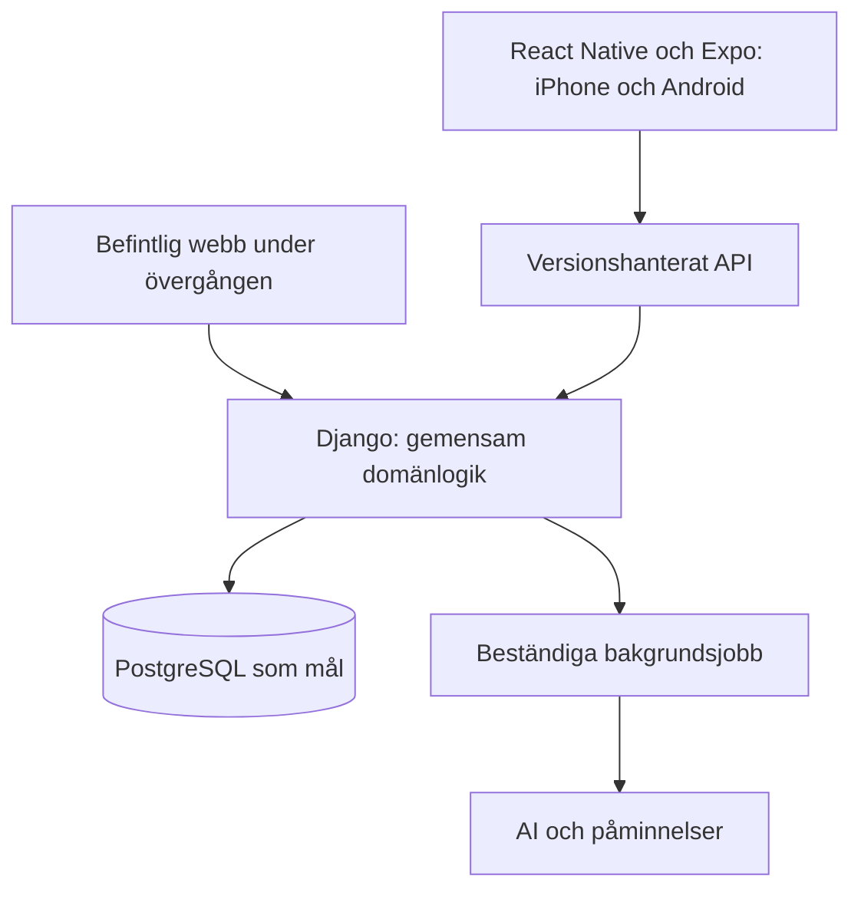

# Trädgårdsrytmen: målarkitektur

Status: arbetsriktning och uttryckliga förslag, 2026-09-25.
Produktomfattning finns i [produktmålen](product-v1.md); ordningen i [arbetsplanen](roadmap.md).

## Nuläge, verifierat i koden

Django med SQLite, JSON-endpoints och ett webbgränssnitt i vanlig JavaScript.
`config/settings.py` aktiverar inte Djangos användar- eller sessionsappar.
`GardenSettings.load()` hämtar en global inställningspost. `GardenArea` har
globalt unika namn, och växter saknar trädgårdstillhörighet. API:et förutsätter
ett betrott hushåll. Webbläsaren sparar inköpslistan lokalt; service worker
cachar skalet men erbjuder inte offline-redigering av trädgårdsdata.
Se även [nuvarande driftgränser](deployment.md).

## Arbetsriktning

Behåll en samlad Django-applikation med tydliga interna ansvarsområden.
Mobilappen använder TypeScript. Skötselregler och behörigheter avgörs på
servern; de ska inte kopieras till mobilappen. Delad kod mellan iOS och
Android ersätter inte plattformsspecifika tester.

Django REST Framework och PostgreSQL är föreslagna teknikval. Inför inte
ett databasbyte i samma ändring som den första kontomodellen. Val av
identitetsleverantör, jobbsystem och betalningsleverantör är öppet.

## Identitet och ägarskap

Målrelationer: användare → medlemskap → trädgård → områden och växter.
En användare kan ha flera medlemskap; en trädgård kan ha flera medlemmar.
Medlemskap är unikt per användare och trädgård. Föreslagna roller är ägare
och medlem. Roller behöver en explicit rättighetsmatris före API-implementation.

Använd Djangos autentiseringsmekanismer som grund, med en egen användarmodell
från första auth-migreringen. Bygg inte egen lösenordskryptografi. Val av
mobil inloggningsmetod, verifiering, sessionslivslängd och återkallning ska
dokumenteras innan autentiserade mobila endpoints införs.

Områden och växter ska få trädgårdstillhörighet. Planer, regler, uppgifter
och källor kan härleda tillhörigheten via växten, förutsatt att alla
relationer valideras. Inställningar ska bli per trädgård. Inventera även
pushprenumerationer, påminnelsehistorik, sökning och administrationskommandon.
Namnsunikhet för områden ska gälla inom trädgården.

Varje läsning, ändring och bakgrundsjobb ska kontrollera rätt trädgård.
En klientvald identifierare ger aldrig behörighet. Testa även främmande
relations-ID:n i annars tillåtna skrivningar. Listor, sökning och bootstrap
får inte läcka andra trädgårdars data.

## Övergång utan förlorad historik

Inför modellerna först som en separat, lokalt verifierad grund. Detta gör
inte det befintliga API:et säkert för flera kunder. Migrera sedan befintlig
data till en uttrycklig äldre trädgård och knyt dess ägare via en explicit
administrativ handling. Tilldela aldrig befintlig data automatiskt till den
första personen som registrerar sig.

Bevara växter, stabila arbetsidentiteter, versioner, källor, anteckningar och
avslutad/hoppad över historik. Öva övergången på isolerade testdatabaser.
Samordna datamigrering och behörighetsövergång innan nya kunders data kan
skapas; det gamla globala API:et får inte ge åtkomst till dessa data.
Behåll privat drift tills alla tillgängliga datavägar är skyddade.

## API och klienter

Föreslagen bas är `/api/v1/`. Skriv ett konkret kontrakt för första flödet:
inloggat konto, skapa/lista trädgårdar, skapa/lista växter samt skapa,
läsa och slutföra manuella uppgifter. Ange fält, datumformat, fel,
behörigheter, exempel och återförsök. Identifierare ska vara opaka för klienten.

Kontraktet ska kunna användas för mobilens exempeldata före färdig server.
Bakåtkompatibilitet behövs eftersom installerade mobilversioner kan vara
äldre än servern. Brytande API-ändringar kräver planerad övergång.

## Offline och synkning — förslag

Börja med läsbar lokal arbetslista och köade klarmarkeringar. Ange tydligt
vad som väntar på synkning. Återförsök ska inte skapa dubbla händelser.
Använd en ändringsversion för att upptäcka konflikter; skriv inte tyst över
nyare data. Separera lokal data mellan konton och rensa vid utloggning.
Full offline-redigering av växter och planer ligger senare.

## AI, påminnelser och betalning

AI startas bara genom en uttrycklig användarhandling med information om
vilka uppgifter som skickas. Jobb måste överleva omstart, ha begränsade
återförsök och bevara misslyckad historik. Planer aktiveras efter granskning.
Per-kund-budget, frekvensbegränsning och uppföljning krävs före publik AI.

Mobilpush får en egen transport; återanvänd påminnelseregler, inte antaganden
om Web Push. Leveranser behöver mottagare, tidszon och dubbleringsskydd.

Servern håller verifierad tillgång till betalfunktioner separat från
köptransporten. Planera för butiksköp, återställning, förnyelser och
återbetalningar med deduplicerade serverhändelser. Första arbetsantagandet
är butikernas köp för digitala funktioner; regionala regler kontrolleras
på nytt när marknad och betalningsflöde beslutas.

## Drift och verifiering

Separera utveckling, testmiljö och produktion. Hantera hemligheter utanför
repo och klient. Planera för PostgreSQL, återläsning av backup, fellarm,
begränsad loggning av persondata, export/radering och kostnadsövervakning.

Verifiera negativa behörighetsfall, bevarad historik, avbrutna anrop,
dubbla återförsök och äldre klienter. Prestandabehov ska mätas; inför inte
mikroservicar utan ett faktiskt behov.

## Referenser

- [Expo: gemensam app för iOS och Android](https://docs.expo.dev/tutorial/introduction/)
- [Django REST Framework](https://www.django-rest-framework.org/)
- [Apple App Review Guidelines](https://developer.apple.com/app-store/review/guidelines/)
- [Google Play: betalningspolicy](https://support.google.com/googleplay/android-developer/answer/10281818?hl=en)

Referenserna användes vid arkitekturdiskussionen. Butiksregler är föränderliga
och ska verifieras inför implementation och lansering.
