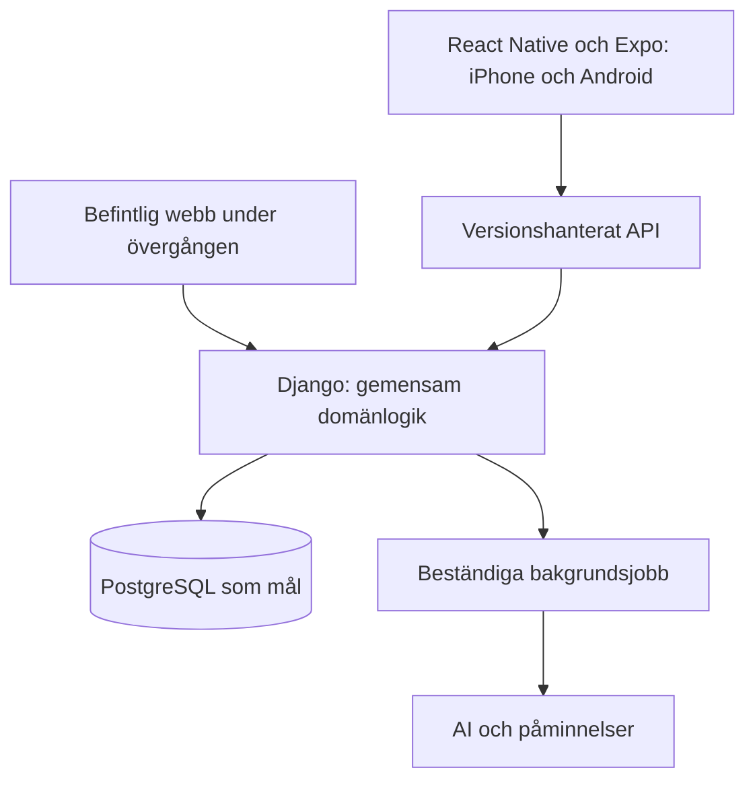

# Trädgårdsrytmen: målarkitektur

## Lokal implementation av hemmaappen, 2026-09-27

Det beställda samlade paketet finns nu för granskning i den isolerade grenen
`task/connected-home-app`: riktig HTTP, privat Django-Bearer-inloggning,
beständig avstämningsjournal och mobilkontroller i CI. Auth0 är fortsatt
ett framtida alternativ och inte ett förkrav för privat hemmabruk.
Se [aktuell leverans, testmatris och aktiveringsgränser](home-app-delivery.md).
Detta är inte publicerat på main eller produktionsaktiverat. Äldre status
nedan beskriver läget före denna implementation. Native körning återstår.

## Aktuell inriktning 2026-09-27

Användaren prioriterar nu en fungerande hemmaapp och en samlad större
implementation framför fler små milstolpar. Nästa arbete är
[ansluten hemmaapp](home-app-next.md). L1, betalningar, butik och publik
flerkundslansering är framtida spår och blockerar inte detta arbete.

Lokal main är verifierat ren på `77d81f56f9994d73874ddbf28f7decf97fbfc10d`
före denna dokumentuppdatering. M1 inklusive granskningsrättningar finns där.
Överlämningen anger push och grön GitHub CI 2026-09-26; fjärrläge och drift
har inte återverifierats 2026-09-27. P3:s privata PostgreSQL-/köaktivering
är dokumenterad i [driftunderlaget](p3-activation.md), inte nykontrollerad här.
M1 är fortfarande syntetisk: riktig mobiltransport och native körning återstår.

## Nuvarande leverans och separata aktiveringssteg

P1/P2/P3 och M1 finns i den lokala main-revisionen ovan. M1 är ännu inte
ansluten till servern. Diagrammet beskriver målarkitekturen. Den tidigare
privata driftaktiveringen redovisas separat i p3-activation.md.

Webbens signerade sidkontext fryser konto/trädgård/exakt medlemskap. Gemensamt
trädgårdslås serialiserar domänskrivningar, även äldre webb och v1. Synkron AI
kontrollerar fryst underlag/behörighet före transport och atomärt vid commit;
ingen transaktion hålls över nätverket. Timeout ger inget dolt återförsök men
synkront läge saknar beständig uncertain-spärr för en senare ny avsikt.
Direkt/köad push bevarar bekräftad leveranshistorik. Transport och databas
saknar gemensam atomär commit; operatörsavstämning behövs vid oklart utfall.
Se [transportkontraktet](transport-boundary-review-fixes.md).

M1-klienten är levererad; separat färdigt L1-beslutsunderlag saknas. Native v1 AI/push,
Auth0-aktivering, offline, betalningar och publik drift återstår enligt
[prioriterad roadmap](roadmap.md). Modellstöd för flera medlemmar innebär inte
färdig inbjudan, sista-ägare-överföring eller radering/export.

## Ursprungsläge före P1, verifierat i dokumentationscommitten

Django med SQLite, JSON-endpoints och ett webbgränssnitt i vanlig JavaScript.
`config/settings.py` aktiverar inte Djangos användar- eller sessionsappar.
`GardenSettings.load()` hämtar en global inställningspost. `GardenArea` har
globalt unika namn, och växter saknar trädgårdstillhörighet. API:et förutsätter
ett betrott hushåll. Webbläsaren sparar inköpslistan lokalt; service worker
cachar skalet men erbjuder inte offline-redigering av trädgårdsdata.
Se även [nuvarande driftgränser](deployment.md).

P1 tillförde konto-/trädgårdsgrunden. P2 har aktiverat säkra Django-sessioner
för privat webb, trädgårdsägarskap, medlemskapsavgränsning, opaka API-ID:n,
versioner, idempotenskvitton och `/api/v1/` för kärnflödet. Bearer-verifiering
är leverantörsneutral och fail-closed tills issuer, audience och JWKS uttryckligen
konfigureras. Se [övergångsinventering](multiuser-transition.md) och
[API-kontrakt](api-v1.md).

## Arbetsriktning

```mermaid
flowchart TD
    M[React Native och Expo: iPhone och Android] --> A[Versionshanterat API]
    W[Befintlig webb under övergången] --> D[Django: gemensam domänlogik]
    A --> D
    D --> P[(PostgreSQL som mål)]
    D --> Q[Beständiga bakgrundsjobb]
    Q --> E[AI och påminnelser]
```

Behåll en samlad Django-applikation med tydliga interna ansvarsområden.
Mobilappen använder TypeScript. Skötselregler och behörigheter avgörs på
servern; de ska inte kopieras till mobilappen. Delad kod mellan iOS och
Android ersätter inte plattformsspecifika tester.

P2:s lilla kärn-API använder Django direkt. P3 implementerar PostgreSQL som explicit alternativ och en databasbaserad
jobbkö med separat worker; privat aktivering dokumenterades 2026-09-26. Se [P3-kontraktet](p3-durable-jobs.md).
Django REST Framework och betalningsleverantör är fortsatt öppna teknikval. Identitetsriktningen beslutades 2026-09-25: Auth0 i EU-region med
Authorization Code + PKCE, verifierbara Universal Links/App Links, roterande
refresh-token och återkallning. Beslutet aktiverar eller beställer ingen extern
tjänst i P2.

## Identitet och ägarskap

Målrelationer: användare → medlemskap → trädgård → områden och växter.
En användare kan ha flera medlemskap; en trädgård kan ha flera medlemmar.
Medlemskap är unikt per användare och trädgård. Roller är ägare och medlem;
första flödets explicita rättighetsmatris finns i API-kontraktet. Medlems- och
raderingsadministration är avsiktligt inte exponerad ännu.

Privat webb använder Djangos sessionsauth, lösenordshantering och CSRF. Mobil-
API:t verifierar RS256, JWKS, issuer, audience, exp, iat och scope med ett
etablerat JWT-bibliotek. `(issuer, subject)` är enda automatiskt stabila
identitetsnyckel; email länkar aldrig konton. Lokal `revoked_before` spärrar
redan utfärdade access-token. Under pilot länkas varje nytt subject uttryckligen
av administratör; automatisk provisionering är avstängd. Access-token gäller
10 minuter. Refresh-token roteras med återanvändningsdetektion, 30 dagars
absolut och 14 dagars inaktiv livslängd. Leverantörens verkliga logout/revoke-
flöde ska integreras och provas innan aktivering.

Områden och växter ska få trädgårdstillhörighet. Planer, regler, uppgifter
och källor kan härleda tillhörigheten via växten, förutsatt att alla
relationer valideras. Inställningar ska bli per trädgård. Inventera även
pushprenumerationer, påminnelsehistorik, sökning och administrationskommandon.
Namnsunikhet för områden ska gälla inom trädgården.

Varje läsning, ändring och bakgrundsjobb ska kontrollera rätt trädgård.
En klientvald identifierare ger aldrig behörighet. Testa även främmande
relations-ID:n i annars tillåtna skrivningar. Listor, sökning och bootstrap
får inte läcka andra trädgårdars data.

## Övergång utan förlorad historik

Inför modellerna först som en separat, lokalt verifierad grund. Detta gör
inte det befintliga API:et säkert för flera kunder. Migrera sedan befintlig
data till en uttrycklig äldre trädgård och knyt dess ägare via en explicit
administrativ handling. Tilldela aldrig befintlig data automatiskt till den
första personen som registrerar sig.

Bevara växter, stabila arbetsidentiteter, versioner, källor, anteckningar och
avslutad/hoppad över historik. Öva övergången på isolerade testdatabaser.
Samordna datamigrering och behörighetsövergång innan nya kunders data kan
skapas; det gamla globala API:et får inte ge åtkomst till dessa data.
Behåll privat drift tills alla tillgängliga datavägar är skyddade.

## API och klienter

Basen är `/api/v1/`. P2 implementerar det konkreta kontraktet för första flödet:
inloggat konto, skapa/lista trädgårdar, skapa/lista växter samt skapa,
läsa och slutföra manuella uppgifter. Ange fält, datumformat, fel,
behörigheter, exempel och återförsök. Servern använder UUID-strängar, men
identifierarna ska fortfarande behandlas som opaka av klienten.

Kontraktet ska kunna användas för mobilens exempeldata före färdig server.
Bakåtkompatibilitet behövs eftersom installerade mobilversioner kan vara
äldre än servern. Brytande API-ändringar kräver planerad övergång.

## Offline och synkning — förslag

Börja med läsbar lokal arbetslista och köade klarmarkeringar. Ange tydligt
vad som väntar på synkning. Återförsök ska inte skapa dubbla händelser.
Använd en ändringsversion för att upptäcka konflikter; skriv inte tyst över
nyare data. Separera lokal data mellan konton och rensa vid utloggning.
Full offline-redigering av växter och planer ligger senare.

## AI, påminnelser och betalning

AI startas bara genom en uttrycklig användarhandling med information om
vilka uppgifter som skickas. Jobb måste överleva omstart, ha begränsade
återförsök och bevara misslyckad historik. Planer aktiveras efter granskning.
Per-kund-budget, frekvensbegränsning och uppföljning krävs före publik AI.

Mobilpush får en egen transport; återanvänd påminnelseregler, inte antaganden
om Web Push. Leveranser behöver mottagare, tidszon och dubbleringsskydd.

Servern håller verifierad tillgång till betalfunktioner separat från
köptransporten. Planera för butiksköp, återställning, förnyelser och
återbetalningar med deduplicerade serverhändelser. Första arbetsantagandet
är butikernas köp för digitala funktioner; regionala regler kontrolleras
på nytt när marknad och betalningsflöde beslutas.

## Drift och verifiering

Separera utveckling, testmiljö och produktion. Hantera hemligheter utanför
repo och klient. Planera för PostgreSQL, återläsning av backup, fellarm,
begränsad loggning av persondata, export/radering och kostnadsövervakning.

Verifiera negativa behörighetsfall, bevarad historik, avbrutna anrop,
dubbla återförsök och äldre klienter. Prestandabehov ska mätas; inför inte
mikroservicar utan ett faktiskt behov.

## Referenser

- [Expo: gemensam app för iOS och Android](https://docs.expo.dev/tutorial/introduction/)
- [Django REST Framework](https://www.django-rest-framework.org/)
- [Auth0: Authorization Code med PKCE](https://auth0.com/docs/api/authentication/authorization-code-flow-with-pkce/authorize-with-pkce)
- [Auth0: EU-region för tenant](https://auth0.com/docs/get-started/auth0-overview/create-tenants)
- [Auth0: verifierbara Universal Links/App Links](https://auth0.com/docs/secure/security-guidance/measures-against-app-impersonation)
- [Auth0: refresh-tokenrotation](https://auth0.com/docs/secure/tokens/refresh-tokens/use-refresh-token-rotation)
- [PyJWT: JWKS, issuer och audience](https://pyjwt.readthedocs.io/en/stable/usage.html)
- [Apple App Review Guidelines](https://developer.apple.com/app-store/review/guidelines/)
- [Google Play: betalningspolicy](https://support.google.com/googleplay/android-developer/answer/10281818?hl=en)

Referenserna användes vid arkitekturdiskussionen. Butiksregler är föränderliga
och ska verifieras inför implementation och lansering.
